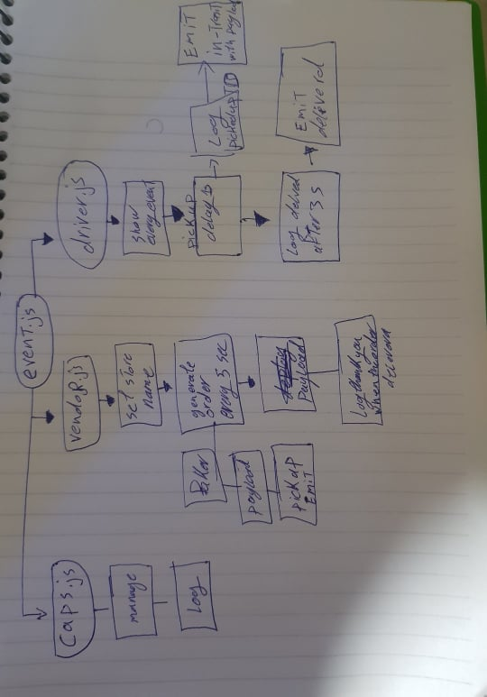

# LAB - Class 16

## Project: caps

### Author: ahmad kmal

### Links and Resources

- [submission PR](https://github.com/401-advanced-javascript-ahmadkmal/authenticated-api-server)

- [ci/cd](https://github.com/401-advanced-javascript-ahmadkmal/caps/actions/runs/135375634)

<!-- - [back-end server url](http://xyz.com) (when applicable)
- [front-end application](http://xyz.com) (when applicable) -->

### Setup

clone it

#### `.env` requirements (where applicable)

i.e.

- `storeName` - ahmadStore

<!-- - `PORT` - Port Number
- `MONGODB_URI` - URL to the running mongo instance/db -->

#### How to initialize/run your application (where applicable)

- `npm start`
- `node caps.js`

#### How to use your library (where applicable)

#### Tests

- it will test the event name and if irt will work spying on console .log

#### UML

